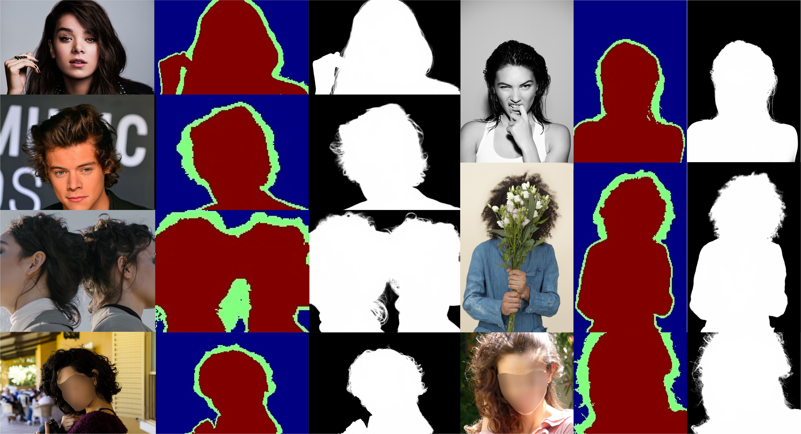

# Lightweight Portrait Matting via Regional Attention and Refinement (WACV 2024)


[(assets/es2_.mp4)]

This is the offical pytorch implementation of the below paper.

[**Lightweight Portrait Matting via Regional Attention and Refinement**](https://arxiv.org/abs/2311.03770)

Yatao Zhong, Ilya Zharkov

Abstract:
We present a lightweight model for high resolution portrait matting. The model does not use any auxiliary inputs such as trimaps or background captures and achieves real time performance for HD videos and near real time for 4K. Our model is built upon a two-stage framework with a low resolution network for coarse alpha estimation followed by a refinement network for local region improvement. However, a naive implementation of the two-stage model suffers from poor matting quality if not utilizing any auxiliary inputs. We address the performance gap by leveraging the vision transformer (ViT) as the backbone of the low resolution network, motivated by the observation that the tokenization step of ViT can reduce spatial resolution while retain as much pixel information as possible. To inform local regions of the context, we propose a novel cross region attention (CRA) module in the refinement network to propagate the contextual information across the neighboring regions. We demonstrate that our method achieves superior results and outperforms other baselines on three benchmark datasets while only uses $1/20$ of the FLOPS compared to the existing state-of-the-art model.

# Getting Started

## Training Data
1. The model is trained with [P3M-10K](https://github.com/JizhiziLi/P3M/tree/master?tab=readme-ov-file) and [BG-20K](https://github.com/JizhiziLi/GFM) (for background augmentation). Download the datasets and save to `./Datasets/P3M-10K` and `./Datasets/BG-20K` respectively.
2. Extract foreground and background images using the below command.
    ```
    python -m P3MData.solve_fg_bg
    ```
    This will save the foreground and background images to `./Datasets/P3M-10K/train/fg` and  `./Datasets/P3M-10K/train/bg`, which will be used by background augmentation during training.

## Model Training
Train the model using the below command.
```
python train.py --gpus 0 --model_version model --train_dir ./train_root/<model_name>
```
The training process saves losses and intermediate visualizations to the specified `train_dir` and can be inspected using tensorboard.
```
tensorboard --logdir ./train_root/<model_name>/logger
```

## Evaluation Data
1. The model is evaluated with [P3M-10K](https://github.com/JizhiziLi/P3M/tree/master?tab=readme-ov-file), [PPM-100]() and [PhotoMatte85](). Download the datasets and save to `./Datasets/P3M-10K`, `./Datasets/PPm-100` and `./Datasets/PhotoMatte85`.
2. Some of the evaluation metrics require trimap annotations. The test set of P3M-10K comes with trimap images already, so we're good on this. However, PPM-100 and PhotoMatte85 do not have ground truth trimap annotations. Following the trimap generation of P3M-10K, we create trimaps from alpha mattes with similar heuristics such as dilations and erosions.
Call the `gen_dataset_trimaps()` function in `PPMData/data_loader.py` and `PhotoMatteData/data_loader.py` to generate trimaps for both datasets.

## Model Evaluation
Run `bash run_benchmark.sh` for model evaluation. You may change the value of `SRC_TRAIN_DIR`, `DATASET` and `PRIVACY_DATA` to specify which model and dataset/subset to evaluate with. A *.csv file will be saved in the model checkpoint folder with all the evaluated metrics.

## Model Profiling
Run `bash run_profile.sh` to profile model inference speed. You may change the value of `SRC_TRAIN_DIR` and `INPUT_SIZE` to specify which model and input resolution to profile with.
